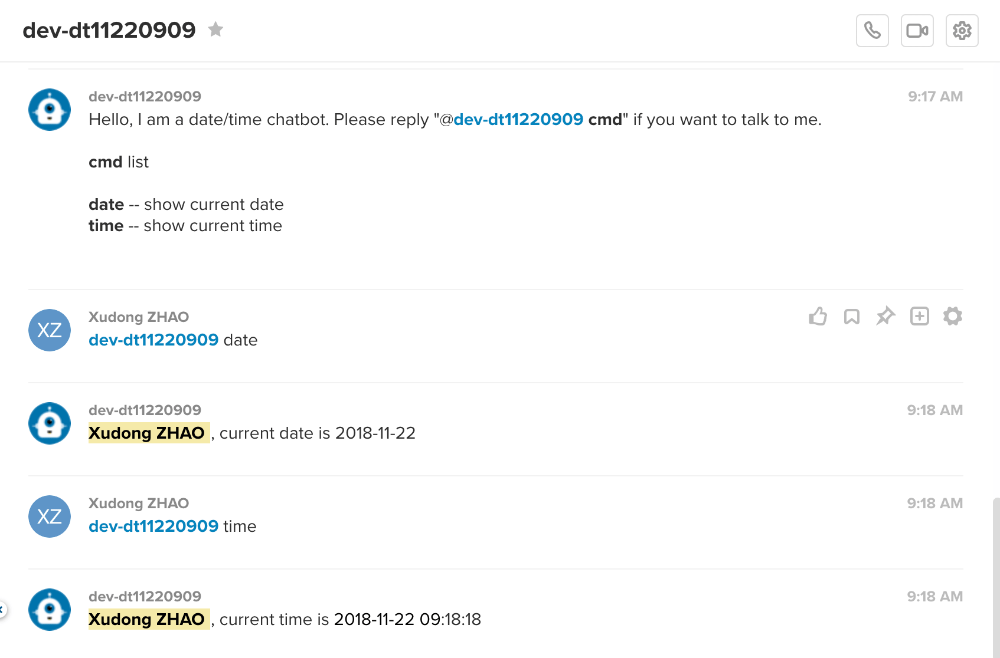
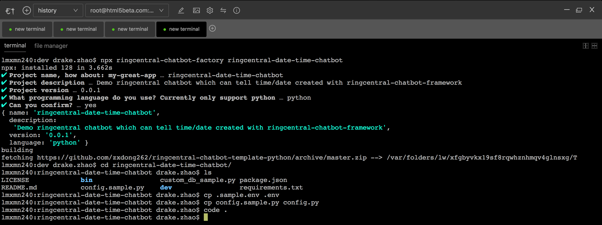

# ringcentral-date-time-chatbot <!-- omit in toc -->

Simple demo ringcentral chatbot which can tell time/date created with [ringcentral-chatbot-framework](https://github.com/zxdong262/ringcentral-chatbot-python) and [ringcentral-chatbot-factory](https://github.com/zxdong262/ringcentral-chatbot-factory)



## Table of contents <!-- omit in toc -->

- [Prerequisites](#prerequisites)
- [Quick start](#quick-start)
- [Test bot](#test-bot)
- [Building and Deploying to AWS Lambda](#building-and-deploying-to-aws-lambda)
- [The bot create process](#the-bot-create-process)
- [License](#license)

## Prerequisites

- Python3.6+ and Pip3
- Nodejs 8.10+/npm, recommend using [nvm](https://github.com/creationix/nvm) to install nodejs/npm
- Create the bot App: Login to [developer.ringcentral.com](https://developer.ringcentral.com) and create an `public` `Server/Bot` app with permissions: `ReadContacts, ReadMessages, ReadPresence, Contacts, ReadAccounts, SMS, InternalMessages, ReadCallLog, ReadCallRecording, WebhookSubscriptions, Glip`

## Quick start

```bash

# use virtualenv
pip3 install virtualenv # might need sudo

# init virtual env
virtualenv venv --python=python3

# use env
source ./venv/bin/activate

# install deps
pip install -r requirements.txt
npm i

# run ngrok proxy
# since bot need https server,
# so we need a https proxy for ringcentral to visit our local server
./bin/proxy
# will show:
# Forwarding https://xxxxx.ngrok.io -> localhost:8989

# create env file
cp .sample.env .env
# then edit .env, set proper setting,
# and goto your ringcentral app setting page, set OAuth Redirect URI to https://https://xxxxx.ngrok.io/bot-oauth
RINGCENTRAL_BOT_SERVER=https://xxxxx.ngrok.io

## for bots auth required, get them from your ringcentral app page
RINGCENTRAL_BOT_CLIENT_ID=
RINGCENTRAL_BOT_CLIENT_SECRET=

# create custom bot config file
cp date-time-bot-logic.py config.py

# run local dev server
./bin/start
```

## Test bot

- Goto your ringcentral app's bot section, click 'Add to glip'
- Login to [https://glip-app.devtest.ringcentral.com](https://glip-app.devtest.ringcentral.com), find the bot by searching its name. Talk to the bot.
- Edit config.py to change bot bahavior and test in [https://glip-app.devtest.ringcentral.com](https://glip-app.devtest.ringcentral.com)

## Building and Deploying to AWS Lambda

AWS Lambda with API Gateway and DynamoDB would give us a flexible way to deploy the bot.

*Be aware that AWS Lambda **ONLY works in linux** on an x64 architecture. For **non-linux os**, we need **docker** to build dependencies, should [install docker](https://docs.docker.com/docker-for-mac/) first.

Get an AWS account, create `aws_access_key_id` and `aws_secret_access_key` and place them in `~/.aws/credentials`, like this:

```bash
[default]
aws_access_key_id = <your aws_access_key_id>
aws_secret_access_key = <your aws_secret_access_key>
```

For more information, refer to https://docs.aws.amazon.com/general/latest/gr/aws-security-credentials.html

```bash
cp dev/lambda/serverless.sample.yml devlambda/serverless.yml
```

Edit `lambda/serverless.yml`, and make sure you set the proper name and required env.

```yml
# you can define service wide environment variables here
  environment:
    NODE_ENV: production
    # ringcentral apps

    ## bots
    RINGCENTRAL_BOT_CLIENT_ID:
    RINGCENTRAL_BOT_CLIENT_SECRET:

    ## user might not need it
    RINGCENTRAL_USER_CLIENT_ID: xxxx
    RINGCENTRAL_USER_CLIENT_SECRET: xxxx

    ## common
    RINGCENTRAL_SERVER: https://platform.devtest.ringcentral.com
    RINGCENTRAL_BOT_SERVER: https://xxxx.execute-api.us-east-1.amazonaws.com/default/poc-your-bot-name-dev-bot

    # db
    DB_TYPE: dynamodb
    DYNAMODB_TABLE_PREFIX: rc_bot2
    DYNAMODB_REGION: us-east-1

```

Deploy to AWS Lambda with `bin/deploy`

```bash
# install serverless related modules
npm i

# Run this cmd to deploy to AWS Lambda, full build, may take more time
bin/deploy

## watch Lambda server log
bin/watch

```

- Create API Gateway for your Lambda function, shape as `https://xxxx.execute-api.us-east-1.amazonaws.com/default/poc-your-bot-name-dev-bot/{action+}`
- Make sure your Lambda function role has permission to read/write dynamodb(Set this from AWS IAM roles, could simply attach `AmazonDynamoDBFullAccess` and `AWSLambdaRole` policies to Lambda function's role)
- Make sure your Lambda function's timeout more than 5 minutes
- Do not forget to set your RingCentral app's redirect URL to Lambda's API Gateway URL, `https://xxxx.execute-api.us-east-1.amazonaws.com/default/poc-your-bot-name-dev-bot/bot-oauth` for bot app.

## The bot create process



## License

MIT
  